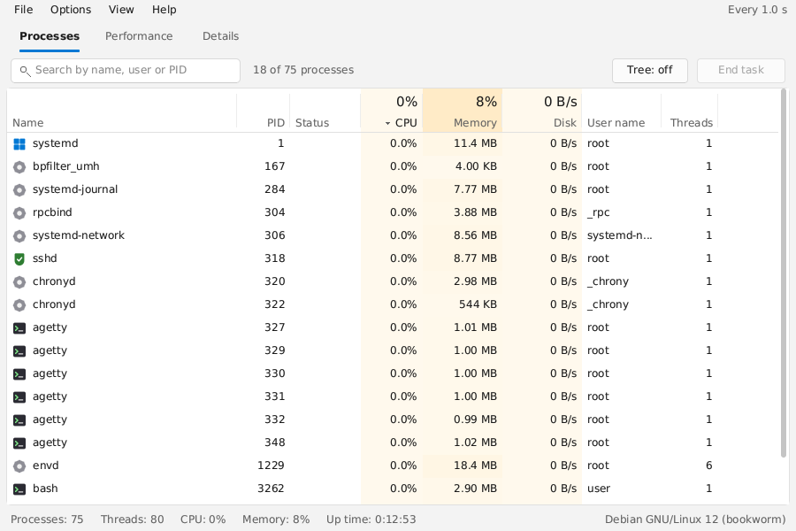
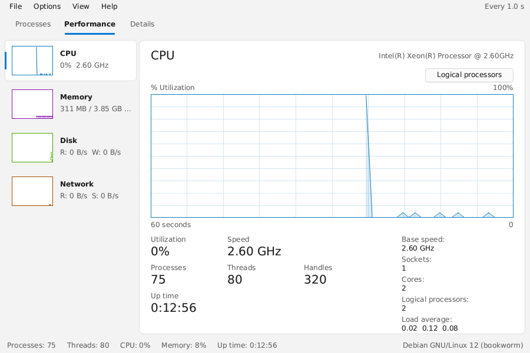
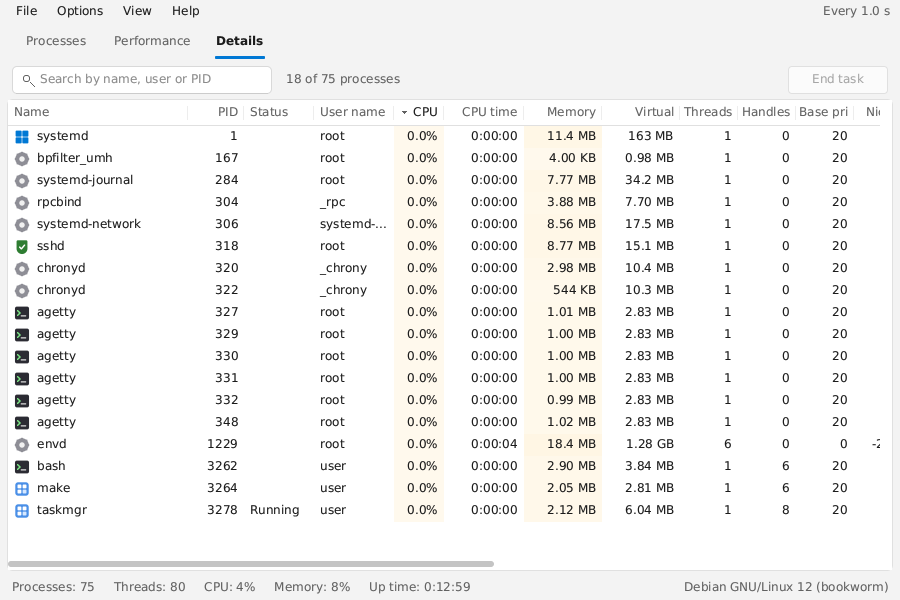

# Task Manager 2.0

A **Windows-Task-Manager-style system monitor** that is absurdly small:
the whole application is a single native executable of **~250–310 KB** (not MB),
uses **~2 MB of RAM** while running, and has **zero dependencies** to install.

| Platform        | Binary                              | Size    |
|-----------------|-------------------------------------|---------|
| Linux x86-64    | `build/linux-x86_64/taskmgr`        | ~250 KB |
| Linux ARM64     | `build/linux-aarch64/taskmgr`       | ~240 KB |
| Windows x64     | `build/windows-x86_64/taskmgr.exe`  | ~290 KB |
| macOS Intel     | `build/macos-x86_64/taskmgr`        | ~255 KB |
| macOS Apple Si. | `build/macos-aarch64/taskmgr`       | ~285 KB |

That is roughly **3 300× under** the 1 GB budget (about 160 KB of each binary is the
anti-aliased font, baked in so nothing needs to be installed).



## Features

**Processes tab** – like the Windows 10/11 Task Manager
- Live list of every process with its **application icon**: name, PID, status, CPU %, memory, disk I/O rate, user, threads
  - icons come from the real app where the OS provides one (`.desktop` / icon themes on Linux,
    the executable's embedded icon on Windows, the `.app` bundle on macOS)
  - everything else gets a crisp category icon: terminal, service, kernel, browser, security, editor, media, …
- Heat-map cells (the darker the orange, the heavier the load) and column totals in the header
- Click any column header to sort; drag column borders to resize
- **Tree view** (`Ctrl+T`) with collapsible parent/child nesting, expand/collapse all
- Instant **search** – just start typing (matches name, command line, user or PID)
- **End task** button, `Del` = end task, `Shift+Del` = end whole process tree (with confirmation)
- Right-click **context menu**: End task, End process tree, Go to details, Properties
- **Properties** dialog (`Enter` / double-click) with full command line, priority, I/O totals…
- Filters: show kernel threads, only my processes

**Performance tab**
- CPU, Memory, Disk, Network graphs with a 60-second history, exactly like the original
- CPU: utilization, clock speed, processes / threads / handles, up time, sockets, cores, load average
- Per-logical-processor view (`Ctrl+L`)
- Memory: in-use / available / committed / cached / swap with composition bar
- Disk & Network: read/write / send/receive throughput with dual line graphs

**Details tab**
- 16 columns incl. CPU time, virtual size, handles, base priority, nice, I/O read/write, parent PID, command line
- Horizontal + vertical scrolling, all columns sortable

**General**
- Windows 11-style look: anti-aliased proportional font (DejaVu Sans, baked in), rounded cards,
  buttons and menus, soft heat-map, pivot tabs, selection pill
- **System light/dark theme** by default (also `Options ▸ Theme` or `--theme light|dark|system`); the
  palette, charts, tables, menus and dialogs all change together
- Update speed High (0.5 s) / Normal (1 s) / Low (4 s) / Paused (`Space`)
- Keyboard-driven everything (`F10` menus, arrows, `Tab` cycles tabs, `Ctrl+1/2/3`)
- HiDPI: auto 2× scaling (or `--scale 2`)
- `--dump` prints a text snapshot (works over SSH, no display needed)
- `--screenshot file.bmp` renders a frame headlessly




## Safety: ending processes

Windows recycles process IDs aggressively, and a naive "kill this pid" can hit the wrong
process (in one report, ending a full-screen game took the desktop shell down with it).
Task Manager 2.0 therefore:

- **verifies the process identity before every kill** – the pid must still carry the same
  start timestamp it had when it was shown; if the pid was reused the kill is refused;
- **validates parent links** – a child is only treated as part of a tree when its parent
  is older than it, so a stale ppid pointing at a newer unrelated process is ignored;
- **never ends session-critical processes implicitly** (`explorer.exe`, `dwm.exe`,
  `csrss.exe`, `winlogon.exe`, `svchost.exe`, `gnome-shell`, `kwin`, `Xorg`, `WindowServer`,
  `Dock`, `Finder`, `launchd`, …). They are skipped by *End process tree*, and a direct
  *End task* shows a red warning where Enter cancels – only **End anyway** / Ctrl+Enter proceeds;
- refuses to end itself, pid 0/1/4 and kernel threads.

If a shell ever does get taken out, **File ▸ Run new task** (Ctrl+N) lets you start
`explorer.exe` again, and on Windows there is a one-click **File ▸ Restart Windows Explorer**.

## How it stays this small

* Written in plain C11, ~3 000 lines, no frameworks, no runtime, no bundled browser.
* The UI is **software-rendered** into a pixel buffer - anti-aliased text from a pre-rasterised
  font, rounded rectangles, icons - and the OS only has to blit the buffer
  (`XPutImage`, `SetDIBitsToDevice`, `CGImage`). A ~250-line PNG decoder loads real app icons.
* On Linux, `libX11` is loaded at runtime with `dlopen` – there is no link-time dependency at all,
  so the binary runs on any distro (also under XWayland). On macOS the same trick is used for
  AppKit through the Objective-C runtime, so it can be cross-compiled without an Apple SDK.
* Data comes straight from the kernel: `/proc` on Linux, `NtQuerySystemInformation` on Windows
  (one syscall for all processes – the same thing the real Task Manager uses), `libproc` / Mach
  on macOS.
* Compiled with `-Os`, dead-code elimination, and stripped.

## Building

**Easiest: the build script** (asks which OS you want, works from Windows, macOS or Linux)

```sh
python3 build.py              # interactive menu: Linux / Windows / macOS / all
python3 build.py windows      # or name the target directly
python3 build.py all
```

It uses your normal C compiler when building for the machine you're on, and
`zig cc` for other operating systems (it offers to `pip install ziglang` if needed).
Output lands in `build/<os>/`.

**Native with make (host platform)**

```sh
make            # -> build/taskmgr  (Linux / macOS; needs only cc + make)
make test       # unit + integration tests (Linux)
```

On Windows with MinGW / MSYS2:

```sh
gcc -Os -std=c11 -o taskmgr.exe src/main.c src/ui.c src/gfx.c src/icons.c src/png.c src/sys_win.c src/win_w32.c ^
    -Wl,--subsystem,windows -lgdi32 -luser32 -ladvapi32 -liphlpapi -lpowrprof -s
```

**All five platforms at once** (from any OS, using `zig cc` as the cross-compiler):

```sh
pip install ziglang               # or install zig from ziglang.org
make all-cross ZIG="python3 -m ziglang"
```

## Usage

```
taskmgr [--scale N] [--interval MS] [--tab 0|1|2] [--size WxH] [--theme system|light|dark]
taskmgr --dump                  # text snapshot to stdout, no window
taskmgr --screenshot out.bmp    # render one frame headlessly
```

| Key                  | Action                                  |
|----------------------|-----------------------------------------|
| `Tab` / `Shift+Tab`  | next / previous tab                     |
| type text            | search (Esc clears)                     |
| `↑ ↓ PgUp PgDn Home End` | select process                      |
| `Enter`              | properties                              |
| `Del` / `Shift+Del`  | end task / end process tree             |
| `← →`                | collapse / expand tree node, h-scroll   |
| `Ctrl+T`             | tree view                               |
| `Ctrl+K`             | show kernel threads                     |
| `Ctrl+U`             | only my processes                       |
| `Ctrl+L`             | per-core CPU graphs                     |
| `Space`              | pause updates                           |
| `F5`                 | refresh now                             |
| `F10`                | open menu bar                           |
| `Ctrl+N`             | Run new task                            |
| `Ctrl+Q`             | quit                                    |

Ending processes you don't own requires root / Administrator, exactly like the original.
The default system theme can be overridden for screenshots or accessibility with `--theme`; the
`TM_THEME=dark` / `TM_THEME=light` environment variables are also understood by the native platform
backends.

## Layout

```
src/tm.h         shared types & the three internal APIs (sys_*, win_*, gfx/ui)
src/ui.c         the task manager itself: tabs, tables, tree, graphs, menus, dialogs
src/gfx.c        software rasteriser (AA text, rounded rects, AA lines, alpha blits)
src/fontdata.h   DejaVu Sans baked to bitmaps (generated by tools/bakefont.py)
src/icons.c      per-process icons: OS lookup + procedural category icons, cache
src/png.c        minimal PNG decoder (inflate + unfilter, all colour types)
src/sys_linux.c  /proc + /sys data collection
src/sys_win.c    NtQuerySystemInformation, psapi, iphlpapi, IOCTL_DISK_PERFORMANCE
src/sys_mac.c    libproc, mach host statistics, sysctl, getifaddrs
src/win_x11.c    X11 window via dlopen (no headers / libs needed at build time)
src/win_w32.c    Win32 window + GDI blit
src/win_mac.c    Cocoa window via objc_msgSend (no SDK needed at build time)
src/main.c       argument parsing and event loop
tests/           unit tests (454 checks) + CLI integration tests + PNG fixtures
tools/bakefont.py rasterises a TTF into src/fontdata.h (dependency-free)
```
